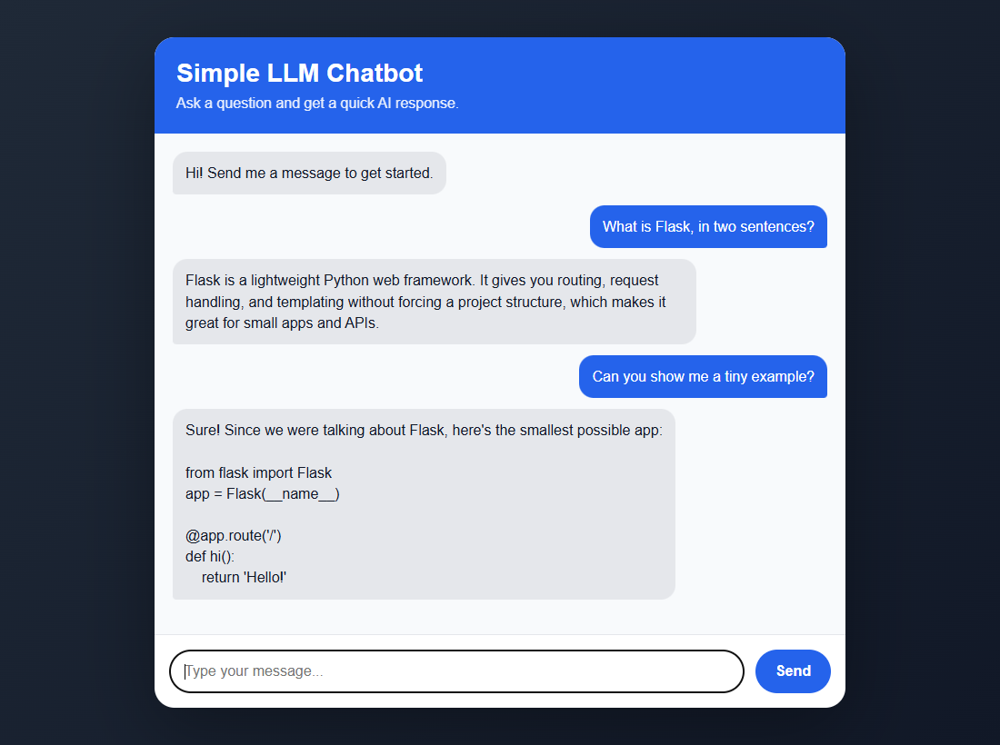

# Simple LLM Chatbot

A minimal, readable chatbot: a ~80-line Flask backend that talks to the OpenAI API, and a plain HTML/CSS/JavaScript chat UI with no build step and no frontend framework. It's a good starting point for learning how LLM chat apps work end to end, or for building your own.



## Features

- **Conversation memory**: the last 20 messages are sent with each request, so follow-up questions work.
- **Any OpenAI chat model**: set it with `OPENAI_MODEL` (default `gpt-4o-mini`).
- **Clear errors**: a missing API key, an empty message, or a failed model request each show a readable message in the chat instead of crashing.
- **Safe input handling**: client-supplied history is validated server-side (only `user`/`assistant` turns, length-capped), and replies render as text, not HTML.
- **Tiny footprint**: three Python dependencies, no JavaScript dependencies.

## Quick start

Requires **Python 3.9+** and an [OpenAI API key](https://platform.openai.com/api-keys).

```bash
git clone https://github.com/djdelacruz2024/simple-llm-chatbot.git
cd simple-llm-chatbot

python -m venv .venv
source .venv/bin/activate          # Windows: .\.venv\Scripts\Activate.ps1

pip install -r requirements.txt
cp .env.example .env               # Windows: Copy-Item .env.example .env
```

Put your key in `.env`:

```ini
OPENAI_API_KEY=sk-...
OPENAI_MODEL=gpt-4o-mini
```

Run it:

```bash
python app.py
```

Then open http://127.0.0.1:5000.

## Configuration

| Variable | Default | Description |
| --- | --- | --- |
| `OPENAI_API_KEY` | none (required) | Your OpenAI API key |
| `OPENAI_MODEL` | `gpt-4o-mini` | Chat model to use |
| `FLASK_DEBUG` | off | Set to `1` for auto-reload and the debugger during development. Never enable it on a public server. |

To change the bot's personality, edit `SYSTEM_PROMPT` in `app.py`. `MAX_HISTORY_MESSAGES` and `MAX_MESSAGE_LENGTH` sit next to it.

## How it works

```
Browser (static/script.js)                Flask (app.py)                     OpenAI
  │  POST /chat                              │                                  │
  │  { message, history: [...] }  ─────────► │  system prompt + history         │
  │                                          │  + new message  ───────────────► │
  │                                          │                 ◄─────────────── │ reply
  │  { reply }  ◄─────────────────────────── │                                  │
  │  append both turns to history            │                                  │
```

The server is stateless: the browser keeps the conversation and sends it with each message, so refreshing the page starts a new chat.

### API

`POST /chat`

```json
{ "message": "Can you show me an example?", "history": [
  { "role": "user", "content": "What is Flask?" },
  { "role": "assistant", "content": "Flask is a lightweight Python web framework..." }
] }
```

Returns `200 { "reply": "..." }` on success, or `{ "error": "..." }` with status `400` (bad input), `500` (missing API key), or `502` (the model request failed).

## Project structure

```
├── app.py               # Flask app: serves the UI and the /chat endpoint
├── templates/
│   └── index.html       # Chat page
├── static/
│   ├── script.js        # Sends messages, keeps history, renders replies
│   └── style.css        # Styling
├── requirements.txt
└── .env.example         # Copy to .env and add your key (.env is git-ignored)
```

## Deploying

`python app.py` uses Flask's development server. For anything public, run it under a production WSGI server, for example:

```bash
pip install gunicorn
gunicorn -w 2 -b 0.0.0.0:8000 app:app
```

Set `OPENAI_API_KEY` as an environment variable on your host rather than shipping a `.env` file. Also note that the app has no authentication or rate limiting, so anyone who can reach it can spend your API credits.

## License

[MIT](LICENSE)
